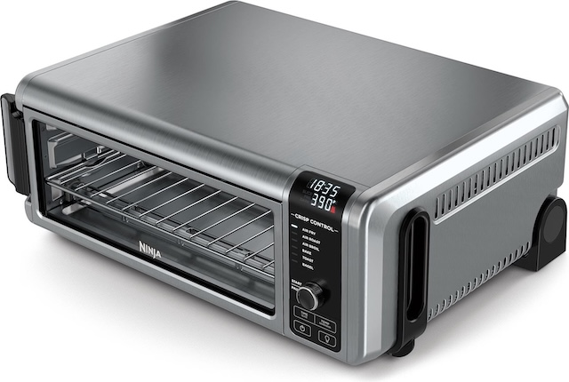
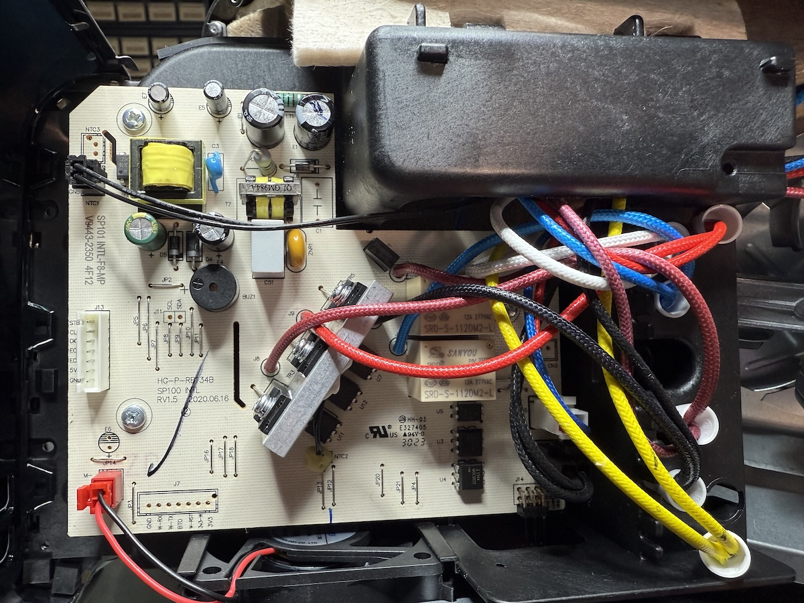
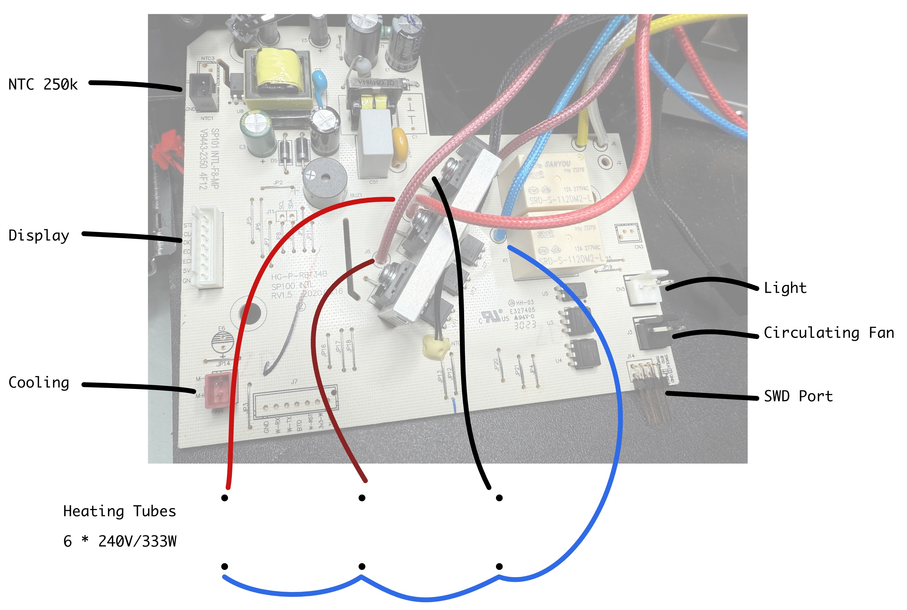

# ninjareflow
SMT Reflow oven with the Ninja 8-in-1

As I just got recently laid of by my employer I am more than welcome to accept donation for this redesign project.
So consider make a Paypal donation to richard.klingler@gmail.com

Finally the Ninja 8-in-1 oven was at an afforable price so I could order it and take it apart.

After a close inspection the initial idea of reusing the mainboard became obsolete as the STM32F030 microcontroller sit on the bottom of the mainboard PCB, and the front panel PCB only contains a display/keypad multiplexer chip called TDM1629D.

So the final design will consist of a new power board and a front panel board with a TFT display.

Also the heating tube wiring is odd in the original design. The top three tubes are individually controlled by BT308X triacs (TR3 - TR5). The bottom three tubes are wired together and switched on/off by relay K1.

